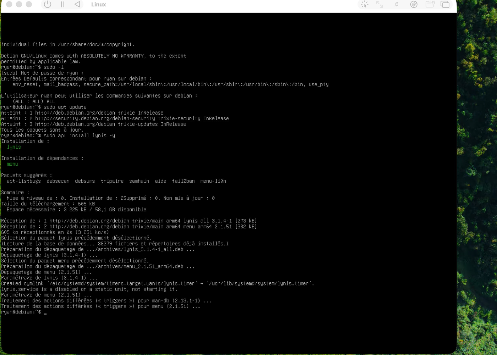
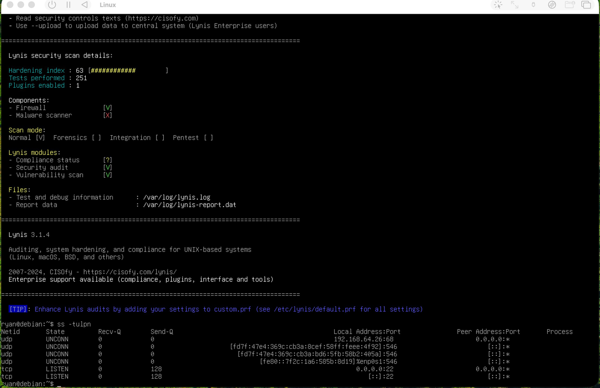
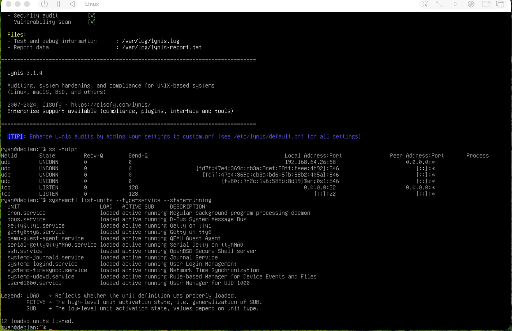
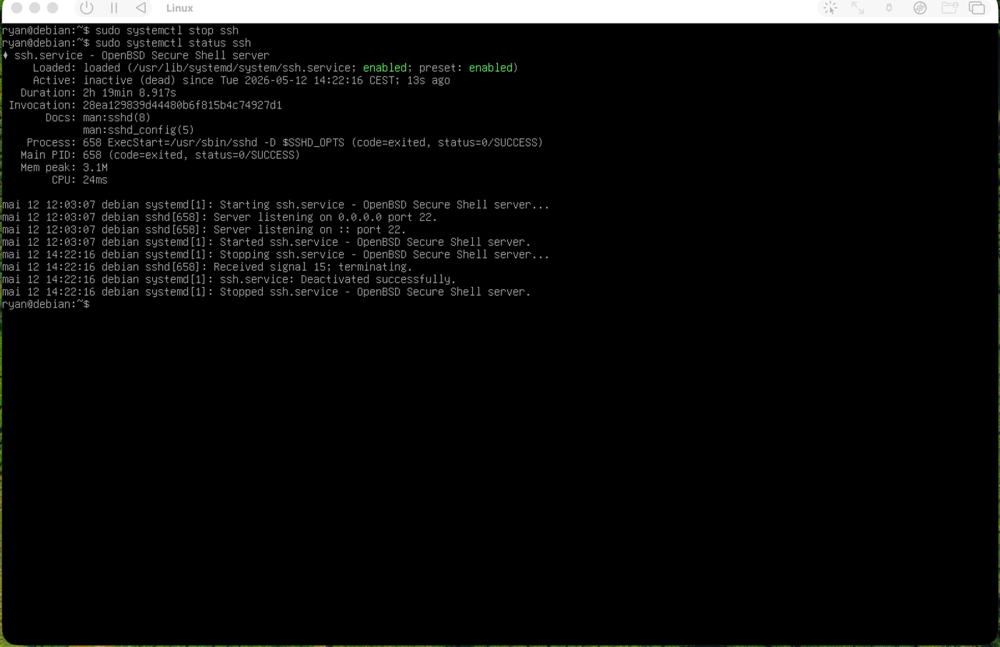

# Audit de sécurité Linux avec Lynis (Debian 13)

TP du module *Sécurité des OS et des réseaux* (Bachelor 3 Cybersécurité, Ynov Montpellier, mai 2026).
Il s'agissait d'auditer une installation Debian fraîche, de comprendre les écarts relevés et de prioriser les corrections.

---

## Environnement

| Élément | Valeur |
|---|---|
| OS | Debian GNU/Linux 13 (trixie), noyau 6.12 ARM64 |
| Virtualisation | UTM / QEMU sur Mac Apple Silicon |
| Outil | Lynis 3.1.4 |

```bash
sudo apt update && sudo apt install lynis -y
sudo lynis audit system
```



## Résultats

| Indicateur | Valeur |
|---|---|
| **Hardening index** | **63 / 100**, installation fonctionnelle mais non durcie |
| Tests effectués | 251 |
| Pare-feu | ✅ présent |
| Scanner de malware | ❌ absent |



## Les 3 risques prioritaires

| Constat | Risque | Criticité | Correction |
|---|---|---|---|
| SSH en écoute sur `0.0.0.0:22` | Brute force | Élevé | fail2ban, authentification par clé |
| `sudo ALL=(ALL) ALL` | Tout exécuter en root sans restriction | Élevé | Limiter sudo aux commandes nécessaires |
| Pas de scanner de malware | Aucune détection | Moyen | rkhunter / chkrootkit |

Services actifs vérifiés avec `ss -tulpn` et `systemctl list-units --type=service --state=running` : SSH était **le seul port ouvert**.



**Mesure immédiate :** arrêt de SSH (`systemctl stop ssh`), ce qui supprime la seule surface d'attaque réseau. Sur un serveur de production, on **sécuriserait** SSH au lieu de l'arrêter.



**Plan de durcissement :** 1. fail2ban pour SSH · 2. restreindre sudo · 3. auditd · 4. rkhunter

## Ce que j'en retiens

- **Un bon score Lynis n'est pas une garantie de sécurité.** Il mesure la conformité à des bonnes pratiques générales, pas la résistance à une attaque dans un contexte donné.
- **Un outil ne remplace pas un analyste.** `sudo ALL` est acceptable sur une VM de TP, mais critique en production : c'est le contexte qui décide.
- **Les mauvaises configurations sont plus exploitées que les failles complexes**, parce qu'elles sont fréquentes, faciles à exploiter et rarement auditées.
